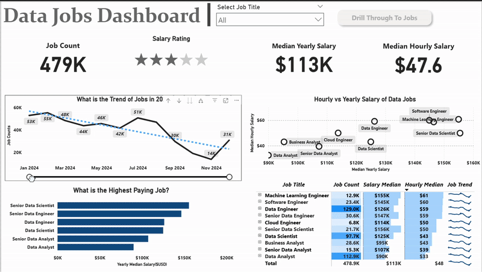

# Data Jobs Market Dashboard – 2024 Overview
## Introduction
Navigating the data job market can be overwhelming when information is scattered across multiple sources. This dashboard was designed for **professionals exploring data careers, career changers, and job seekers** to bring together critical insights in one place.

Using a dataset of 2024 data-related job postings *(covering job titles, salaries, locations, and hiring trends)*, this Power BI report turns raw job data into an interactive tool to explore market patterns, pay scales, and employment opportunities.

---

## Key Skills Applied
This project put multiple Power BI skills into action:

- **⚙ Data Cleaning & Preparation (Power Query):** Standardized column formats, handled missing values, adjusted data types, and created calculated fields.

- **📐 Custom Measures:** Created DAX measures for metrics such as Median Annual Salary, Hourly Rates, and Job Count.

- **📊 Visualization Variety:** Applied column charts, bar charts, line charts, and scatter plots to reveal trends and comparisons.

- **🌍 Location Insights:** Used map visuals to display worldwide job distribution.

- **📌 KPI & Summary Cards:** Showcased essential figures at a glance using card visuals.

- **🎨 Report Design:** Focused on a clean, user-friendly interface with logical grouping of visuals and clear navigation.

- **🔍 Interactivity & Navigation:**

    - **Slicers** for filtering by role

    - **Drill-through** pages for detailed role-specific analysis

    - **Buttons and bookmarks** for smooth navigation between views

---

## Dashboard Pages

  *This report is split into two distinct pages to provide both a high-level summary and a detailed analysis.*

### Page 1 – Market Summary View

The first page acts as a bird’s-eye view of the job market. It displays:

- Total job postings in 2024

- Median annual and hourly salaries

- Trend of job postings over time

- Highest-paying job titles

- Hourly vs. yearly pay comparisons

- Job count by title with median salaries and trends

### Page 2 – Job Role Drill-Through

From Page 1, you can drill into this detailed view for any job title. Here you’ll find:

- Median hourly and annual salaries for that specific role

- Work-from-home percentage

- Job postings that do not require a degree

- Health insurance offering rate

- Global map of job locations

- Platforms with the highest number of listings

- Job type breakdown (full-time, contract, etc.)

---

## 🎥 Video Demo
*To see the dashboard in action, watch this short walkthrough:*

---

## Conclusion

This dashboard serves as a career decision-making assistant for anyone interested in the data field. By combining market statistics, salary benchmarks, and hiring patterns into an interactive visual format, it enables users to quickly identify promising opportunities and better plan their career trajectory.

